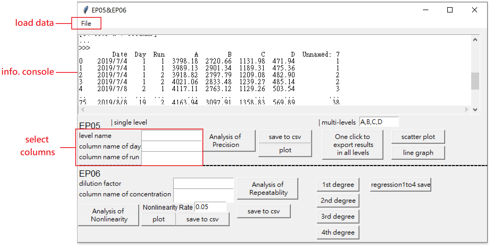
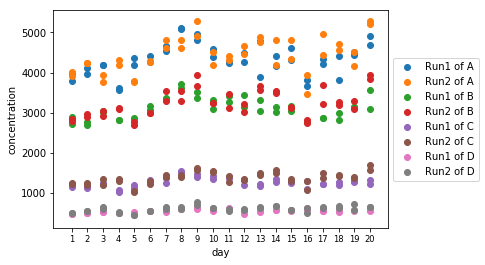
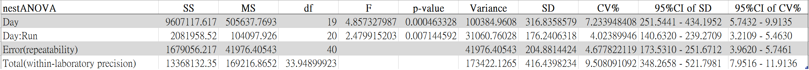
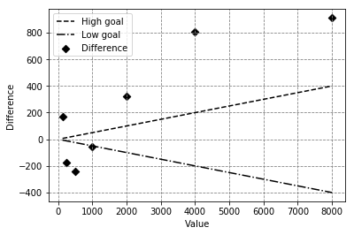
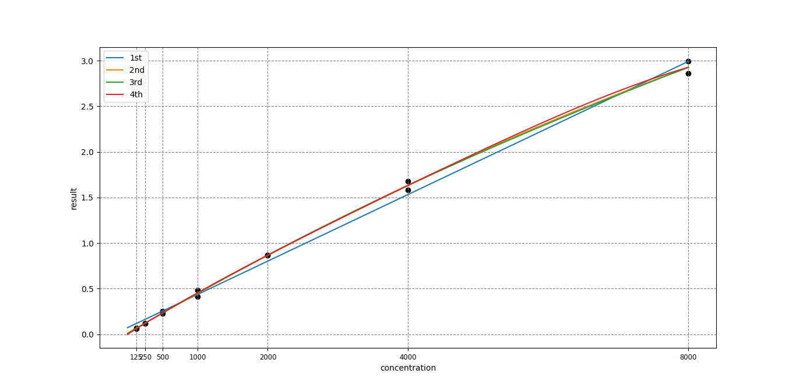

# Experimental Data Analysis Kit for EP05, EP06

It is time-consuming that doing some laboratory data analysis repeatly by existing softwares.To address this concern, I firstly set up the algorithm for precision and linearity analysis that comply with EP05, 06's regulations. Next, I used PyTK to take GUI to shape, so that our members executed analysis easily. This kit also provide data visualization function which can let user plot usable graph for reports via only clicking a bottun. 

## GUI



## run

``` 
python main.py
```

## output of precision

1. laboratory data



2. report of nestANOVA analysis



## graph output of linearity

1. 1 to 4 degree regression to fit laboratory data



2. acceptable nonlinearity range of laboratory data

